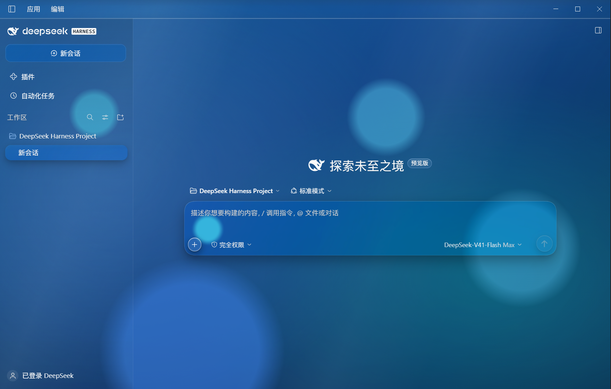

# Glass Skins · 玻璃皮肤

An independent appearance plugin for DeepSeek Harness: translucent glass, flowing gradients and nine themes. Disable or uninstall it whenever you need.

[中文](README.md) · [Download](https://github.com/I-QX-I/dsh-plugin-skins/releases/latest) · [Credits](CREDITS.md) · [References](docs/SOURCES.md)

## Preview



*Original Windows screenshot of the Aero theme with the host UI in Chinese; not a rendered mockup.*

## Install with one chat request

Paste this line into a **DeepSeek Harness conversation**, then send:

```text
Install and enable Glass Skins from https://github.com/I-QX-I/dsh-plugin-skins/releases/download/v2.6.3/glass-skins.zip; follow the bundled AI-INSTALL.en.md, use the current profile and preserve existing preferences.
```

This is an AI installation request, not a shell command. The assistant downloads and verifies the ZIP, then uses the host plugin manager or official CLI, subject to host permissions. If downloading is unavailable, attach the [ZIP](https://github.com/I-QX-I/dsh-plugin-skins/releases/download/v2.6.3/glass-skins.zip) and ask to install. Use the Release installation package, **not GitHub's automatically generated Source code ZIP**. No source build or manual extraction is required. Open **Settings → Skins** afterward. Fresh installs use the Aero liquid-glass preset; upgrades preserve explicit preferences. The downloaded original can be moved, renamed or deleted; keep the managed installation cache. The assistant will indicate if a restart is needed.

## Features

Nine palettes; liquid and frosted glass; independent rim highlight and refraction thickness; adjustable gradient flow, planar light drift, color separation, opacity and lighting. Long text uses lightweight reading glass. English/Chinese, host light/dark appearance, reduced motion and capability fallbacks are supported. Preferences persist. Disable or uninstall through the host manager.

Aero · Aurora · Graphite · Phoenix · Jade · Flame · Teal · Rose Quartz · Amber.

## Compatibility

Visually and operationally tested primarily on Windows Electron/Chromium Harness. macOS/Linux have not received real-device visual acceptance. CI does not establish GPU or future host compatibility. Fine corner strokes may show pixel discontinuities at some DPRs. Pure transparency is experimental and may expose overlapping background text. Web materials approximate glass; no universal full-frame-rate guarantee.

The plugin does not patch the host executable or change accounts, models, chat data or other plugins. [Compatibility](docs/COMPATIBILITY.md) · [Device checklist](TEST-OTHER-DEVICE.md).

## Development

**The development language is JavaScript, not Java.** Client, installation and build code use JavaScript (`.js` / `.mjs`). CSS is embedded as strings in client modules; JSON/YAML describe configuration and Markdown contains documentation. GitHub's language bar is not a breakdown of every file type in the repository.

Node.js 22+:

```sh
npm ci
npm run build
npm test
npm run release -- --out=../glass-skins-release
```

Edit `src/client/`, then build the generated `client.js`. Public tests cover reproducible builds, defaults, preference persistence/stale echoes/migration, bilingual credits and installation cache integrity. Historic local 37-check browser suites rely on private host snapshots and are not presented as portable CI. Real-device visual and performance checks remain essential.

[验证摘要 / Validation](docs/VALIDATION.md) · [Architecture](docs/ARCHITECTURE.md) · [Contributing](CONTRIBUTING.md) · [Security](SECURITY.md) · [Changelog](CHANGELOG.md).

## Development credits and references

See [Credits](CREDITS.md) for development collaborators, host and dependency authors, [46 research references](docs/SOURCES.md) for design research, and [Notice](NOTICE.md) for third-party licenses. Releases retain the original dependency licenses. Acknowledgement does not imply review or endorsement. This is not an official DeepSeek or Apple product. No private conversations, host files, reference-game assets or research source snapshots are distributed.

## License

Copyright © 2026 爱伦提卡. [MIT licensed](LICENSE): use, modify and redistribute, including commercially. Retain the copyright, original-project URL and permission notice in the license when distributing copies or derivatives. No extra mandatory UI attribution is required.

---

[](https://afdian.com/a/alantica)

Optional support via Afdian; features and usage rights remain the same.
