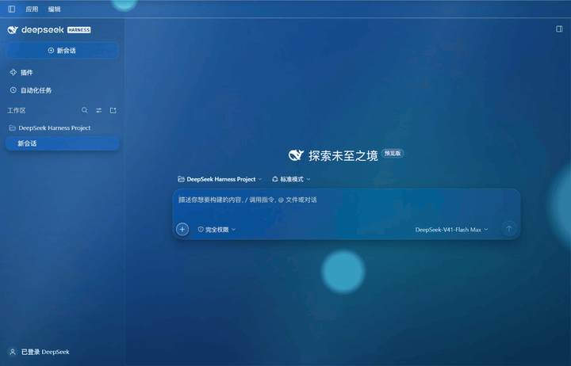

# Glass Skins · 玻璃皮肤

An independent DeepSeek Harness skin plugin. Nine palettes, liquid and frosted glass. Disable or uninstall at any time.

[中文](README.md) · [Download](https://github.com/I-QX-I/dsh-plugin-skins/releases/latest) · [Changelog](CHANGELOG.md)

## Live preview



Aero liquid glass, recorded from the running app and looped automatically. [Still screenshot](docs/assets/aero-window.png) · [Recording notes](docs/PREVIEW.md)

<details>
<summary>Input-area glass detail</summary>


A crop from the same recording, showing background motion through the glass.

</details>

## Installation

Send this line in a DeepSeek Harness conversation:

```text
Install and enable Glass Skins from https://github.com/I-QX-I/dsh-plugin-skins/releases/download/v2.6.3/glass-skins.zip; follow the bundled AI-INSTALL.en.md, use the current profile and preserve existing preferences.
```

Alternatively, [download glass-skins.zip](https://github.com/I-QX-I/dsh-plugin-skins/releases/download/v2.6.3/glass-skins.zip), attach it to a conversation and ask to install. Use the Release installation package, not the Source code ZIP. Installation uses the host plugin manager or official CLI and respects host permissions.

Open **Settings → Skins**. Fresh installs use Aero liquid glass; upgrades preserve existing choices. The downloaded original can be moved or deleted; retain the host-managed installation cache.

## Themes and materials

Aero · Aurora · Graphite · Phoenix · Jade · Flame · Teal · Rose Quartz · Amber

- Liquid and frosted glass; separate highlight and refraction-thickness controls.
- Adjustable gradient flow, light drift, color separation, opacity and lighting.
- Lightweight reading material for long drafts and messages, preserving message behavior.
- English/Chinese, host light/dark appearance, reduced motion and capability fallbacks.

## Compatibility

Real-device checks primarily cover Windows Electron/Chromium Harness. macOS/Linux have not received real-device visual acceptance. Host updates may require adaptation. Fine corner strokes have pixel limits at some DPRs; pure transparency is experimental. See [Compatibility](docs/COMPATIBILITY.md) and the [Device checklist](TEST-OTHER-DEVICE.md).

The plugin does not modify host executables, accounts, models, chat data or unrelated plugins.

## Development

JavaScript, with CSS embedded in client modules. Node.js 22+:

```sh
npm ci
npm run build
npm test
```

Edit `src/client/` and build `client.js`. [Architecture](docs/ARCHITECTURE.md) · [Contributing](CONTRIBUTING.md) · [Validation](docs/VALIDATION.md) · [Security](SECURITY.md)

## Credits and license

[Development credits](CREDITS.md) · [Design and technical references](docs/SOURCES.md) · [Third-party licenses](NOTICE.md)

Copyright © 2026 爱伦提卡. [MIT](LICENSE): use, modify and redistribute commercially, retaining copyright, source and license notices. This is not an official DeepSeek or Apple product.

---

[](https://afdian.com/a/alantica)

Optional support; features and usage rights remain the same.
