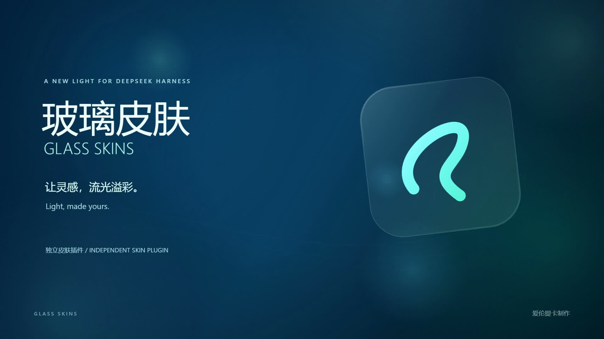
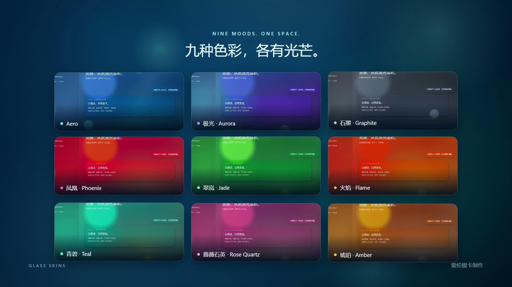

# 玻璃皮肤 · Glass Skins

**DeepSeek Harness 独立玻璃皮肤插件 · 爱伦提卡制作**

[English](README.en.md) · [下载安装](https://github.com/I-QX-I/dsh-plugin-skins/releases/latest) · [宣传片](https://github.com/I-QX-I/dsh-plugin-skins/releases/download/v2.6.3/glass-skins-promo.mp4) · [贡献致谢](CREDITS.md) · [研究资料](docs/SOURCES.md)



通透玻璃、流动色彩，给熟悉的工作空间一种新的光感。保留宿主功能和已有偏好，可随时关闭、停用或卸载。

## 一句话安装

把下面这一行粘贴到 **DeepSeek Harness 的对话输入框**，发送即可：

```text
请安装并启用爱伦提卡制作的玻璃皮肤插件：https://github.com/I-QX-I/dsh-plugin-skins/releases/download/v2.6.3/glass-skins.zip；按包内 AI-INSTALL.md 执行，沿用当前 profile，保留已有偏好。
```

这是一条给宿主 AI 的安装请求，不是终端命令。AI 下载正式 ZIP、校验并使用宿主管理器安装；缺少安装工具时可使用官方 CLI。依然遵守宿主所需权限。若 AI 无法下载，直接[下载 ZIP](https://github.com/I-QX-I/dsh-plugin-skins/releases/download/v2.6.3/glass-skins.zip)，拖进对话后说「安装这个插件」。不用克隆仓库、手工解压或构建源码。

安装后打开 **设置 → 皮肤**。下载原件可移动、改名或删除；安装用的受管理缓存应保留。新安装使用 Aero 液体玻璃预设，升级保留已有显式选择。需重启时，安装助手会提示。

## 九款主题，两种玻璃



Aero · 极光 · 石墨 · 凤凰 · 翠岚 · 火焰 · 青境 · 玫瑰石英 · 琥珀。

- 液体玻璃与模糊玻璃；边缘高光和实际折射厚度分别调节。
- 渐变流动速度、光球平面漂移速度、色彩区分度、透明度与光感可调。
- 长输入和长消息使用轻量阅读材质，减少整面折射成本；不会限制字数或改动消息。
- 中英文界面、浅深色宿主、系统减少动画偏好、浏览器能力不足时的回退。
- 单独插件包，不改宿主 app.asar，不改账号、模型、聊天或其他插件。

## 兼容性与边界

主要在 Windows 的 Electron/Chromium Harness 上完成真实视觉、安装和响应验证，另有干净配置安装验证。macOS/Linux 尚无实机验收，不因 CI 通过就视为视觉兼容。宿主更新改变 DOM/插件接口时可能需要适配。

本项目是网页玻璃近似。部分 DPR 下极细圆角线可能像素断续；全透为实验选项，背景文字重叠时可读性降低。推荐日常使用默认极透或更稳重的透明档位。不承诺所有设备满帧。关闭总开关应恢复宿主外观。

详情：[兼容说明](docs/COMPATIBILITY.md) · [其他设备测试](TEST-OTHER-DEVICE.md)。

## 开发

需要 Node.js 22 或更高版本：

```sh
npm ci
npm run build
npm test
npm run release -- --out=../glass-skins-release
```

维护 `src/client/`，通过 `parts.json` 与模板合成为宿主加载的单文件 `client.js`；不要直接修补生成文件。`npm test` 包含构建一致性、默认配置、偏好旧值回显/迁移、完整双语致谢和安装缓存校验。公开 CI 是可移植检查，不替代真实窗口视觉/性能验收。历史本地开发的 37 项测试含宿主私有快照及机器诊断环境，未作为可移植 CI 宣称发布。

[验证摘要 / Validation](docs/VALIDATION.md) · [架构](docs/ARCHITECTURE.md) · [贡献指南](CONTRIBUTING.md) · [安全问题](SECURITY.md) · [更新记录](CHANGELOG.md)

## 署名、许可与致谢

Copyright © 2026 **爱伦提卡**。本项目采用 [MIT](LICENSE)，允许使用、修改和分发；请保留许可证中的版权与许可文字。制作者署名不是第三方库的版权声明。

开发工具协作：DeepSeek Harness 内的 AI、OpenAI Codex。感谢 DeepSeek Harness 社区与相关开源作者；完整职责区分、依赖许可和 46 项研究链接见 [CREDITS.md](CREDITS.md)、[NOTICE.md](NOTICE.md)、[SOURCES.md](docs/SOURCES.md)。发布包携带三项 MIT 依赖并保留其原始许可证。

本项目不是 DeepSeek、Apple 或其他参考机构的官方产品；参考与致谢不表示参与或背书。没有分发游戏素材、用户截图、聊天数据、宿主私有文件或研究源码快照。

[显性及隐性制作者标记 / Visible and non-UI creator marks](WATERMARKS.md)

自由使用、修改与分发；分发副本/衍生版本时，请保留 LICENSE 内的制作者版权声明、原项目链接和许可文字。界面无需增加新的强制展示规则。
